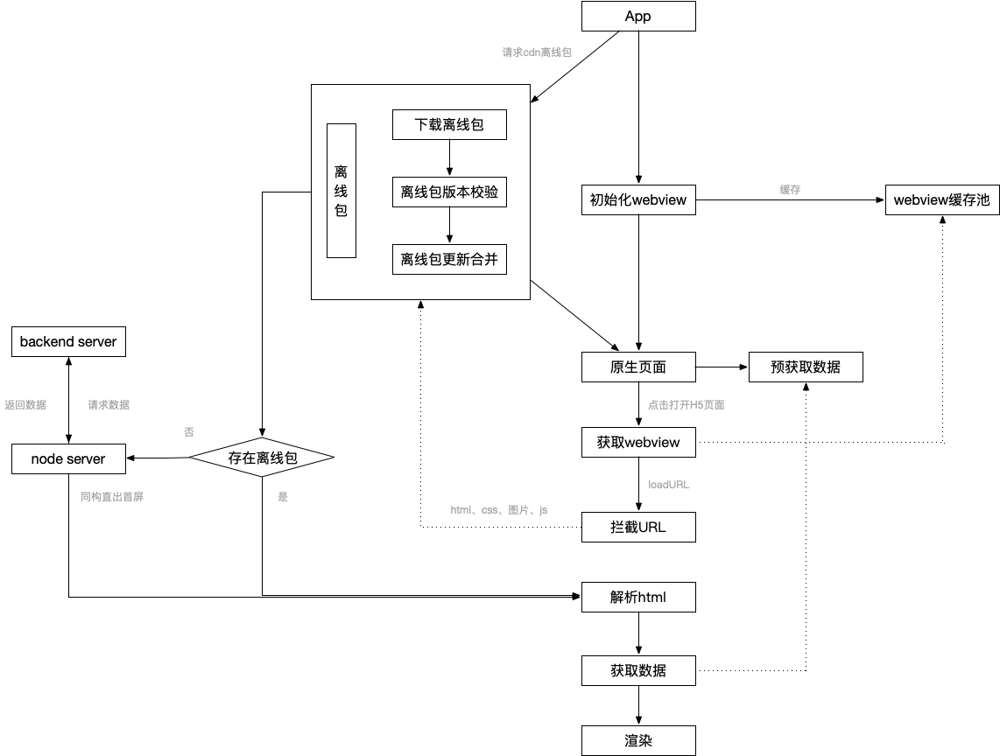

# H5首屏优化方案的探索

## 前言

公司的业务主要是基于APP的产品，而为了达到快速迭代上线，主要还是使用了Hybrid的方式，但是相比原生而言，使用`webview`+`H5`还是存在一些被诟病的问题，那就是性能和体验达不到原生的程度，虽然说随着移动设备性能的增强和5G的到来，一些问题可以得到缓解。

## 问题

H5存在的一些问题：

- 页面启动白屏时间长：随着MVVM框架的发展，目前大部分的Web应用都是SPA应用，在渲染页面之前还需要进行数据资源请求

- 交互响应不流畅：基于webview的内核，渲染机制和交互API都无法达到系统级

对于特效动画不多的应用，交互体验上的影响并不算大，主要的问题还是用户从打开页面到可交互的时间。

### 页面启动的过程

为什么H5页面的启动时间长？尤其是SPA应用？

从用户点击到页面渲染完成，大体上经历了一下过程：

初始化webview => 请求html => 解析html => 请求css和js => 渲染 => 解析和执行js => 请求数据 => 渲染 => 下载图片 => 渲染 => 页面显示可交互

常规SPA应用中，通常在请求完并且执行js时，才会出现`loading`之类的画面，而在这之前都是白屏，用户体验就很差，尤其是网络慢的时候。那么怎么才能进行优化呢？

## 优化

从整个过程中，可以看到涉及到了客户端、前端和后端，除开后端接口和服务器的优化，接近用户侧的客户端和前端是我们的优化空间。

### 前端优化

在过去PC和手机浏览器中，已经有无数的优化手段，总结起来无外乎以下几点：

- 减少请求数量：合并资源，减少HTTP请求，懒加载，内联资源等
- 减少请求资源大小：压缩资源，gzip，webp图片，减少cookie等
- 提高请求速度：DNS预解析，资源预加载，CDN加速等
- 缓存：浏览器缓存，manifest缓存等
- 渲染：css、js加载顺序，同构直出等

几乎所有的应用最先遇到的性能瓶颈都是网络请求，所以能减少请求的缓存就显得比较重要。

浏览器的缓存机制这里就不做赘述，主要有通过设置`Cache-Control`等HTTP请求头的方式和PWA中利用Service Worker的方式。利用浏览器缓存机制，页面再次请求对应资源时，可以从缓存中获取，减少网络请求，而数据方面的请求，可以通过localStorage进行数据的缓存，首次渲染时可以使用本地缓存数据，然后再请求更新。

通过以上手段可以使页面第二次被访问时快速打开，但是第一次访问时，依旧存在慢的问题。

### 同构直出

首次访问需要加载js资源，然后再发起请求，等数据返回渲染后，用户才能看到。在上古年代，页面基本上都是通过服务端渲染的，页面返回时就已经带上了数据，减少了再次数据请求的过程。借助于nodejs，client端和server端使用同一套代码，可以通过node层进行数据和模版的组装，返回首屏的内容到浏览器渲染，达到“直出”，而首屏外的内容，可以用原来的方式，请求到js资源后再进行渲染，这样可以提高首屏的速度。

### 预置内联

此时，页面要渲染，除了数据，还需要等待样式文件的加载，那么这一块可以优化吗？

同构直出可以看作是数据内联到页面中，那么作为首屏的样式资源，其实也可以通过构建打包的流程，将其内联到页面中，那么当请求页面时，服务器返回的页面，就已经包含了首屏所需要的样式和数据，用户第一时间就可以看到页面，首屏外的样式资源，可以用原来的方式再去请求渲染。

此时，对于首屏，页面打开的流程缩减为：

初始化webview => 请求html => 解析首屏html、css => 渲染 => 下载图片 => 渲染 => 页面显示可交互

### 客户端优化

webview在启动前需要进行初始化，那么我们其实可以在webview加载页面之前就将它初始化完成，将其放入缓存池，之后直接从缓存池中获取预创建的webview，而非等到用户打开页面时再进行初始化。

### 离线包

之前的优化方式都是放在前端，数据源直接来源于服务端，在App中，我们是不是可以从APP中获取数据资源，在webview中无需任何请求，直接就是组装渲染？

对于非个性化页面，即所有用户所见相同的页面，每个版本用户所见内容相同，那么这一块内容其实可以打成一个资源包，这个资源包包含html、css、图片和js，客户端在某个时间点可以去预先请求这个资源包，之后用户打开这个页面时，客户端拦截对应的请求地址，从本地资源包找到对应的文件返回，同时客户端提供数据源，html获取到资源和数据后进行组装渲染。

离线包的方案涉及以下几个问题：

- 前端工程的打包构建流程：增量、全量打包，公共资源包

- 更新机制：增量更新和合并，全量更新

- 安全：离线包下发版本校验，防止篡改

- 客户端的资源拦截机制

- 回退方案：离线包下载失败，回退到同构直出方案

通过离线包的方案，在用户打开页面过程中，可以做到几乎无请求，达到秒开的效果。当然，结合几种方案，必然对前端工程的打包构建影响较大，需要设计好整个完成的打包构建方案。

## 整体流程方案

## 总结

整体的优化需要从客户端、前端到后端一起进行，每个环节都进行了优化的话，基本就能达到秒开的性能。总结起来，大致的优化思路就是：

- 预加载和创建：能提前做好准备的都提前做好准备

- 缓存：能缓存的都进行缓存

- 并行：能同时进行的尽量同时进行

当然有些优化方法还需要视业务场景而定，比如跟用户强关联的个性化模块就不好做离线包。

## 参考资料

[腾讯祭出大招VasSonic，让你的H5页面首屏秒开！](https://mp.weixin.qq.com/s?__biz=MzA3NTYzODYzMg==&mid=2653579269&idx=2&sn=bb9822d2cd9b0dc79134bd9990220571&chksm=84b3ba02b3c43314aeb54375f3e729fcef5495ab39a64c94719e218f28caa1fc4dde50f7c92d&mpshare=1&scene=23&srcid=0825CYa3KqzW532zZLQwVnnH%23rd)

[QQ会员基于 Hybrid 的高质量 H5 架构实践](https://mp.weixin.qq.com/s?__biz=MzA3NTYzODYzMg==&mid=2653579229&idx=2&sn=39bb897885791bf35147e4891624da38&chksm=84b3b5dab3c43ccc4ce034b67dbfb459db158999951953dc29f0f78f62d169f39de7f15b702d&mpshare=1&scene=23&srcid=0825igdu2RvKu7gPFF5FjESH%23rd)

[百度APP-Android H5首屏优化实践](https://mp.weixin.qq.com/s/AqQgDB-0dUp2ScLkqxbLZg)

[移动端本地 H5 秒开方案探索与实现](https://www.cnblogs.com/qcloud1001/p/9167371.html)