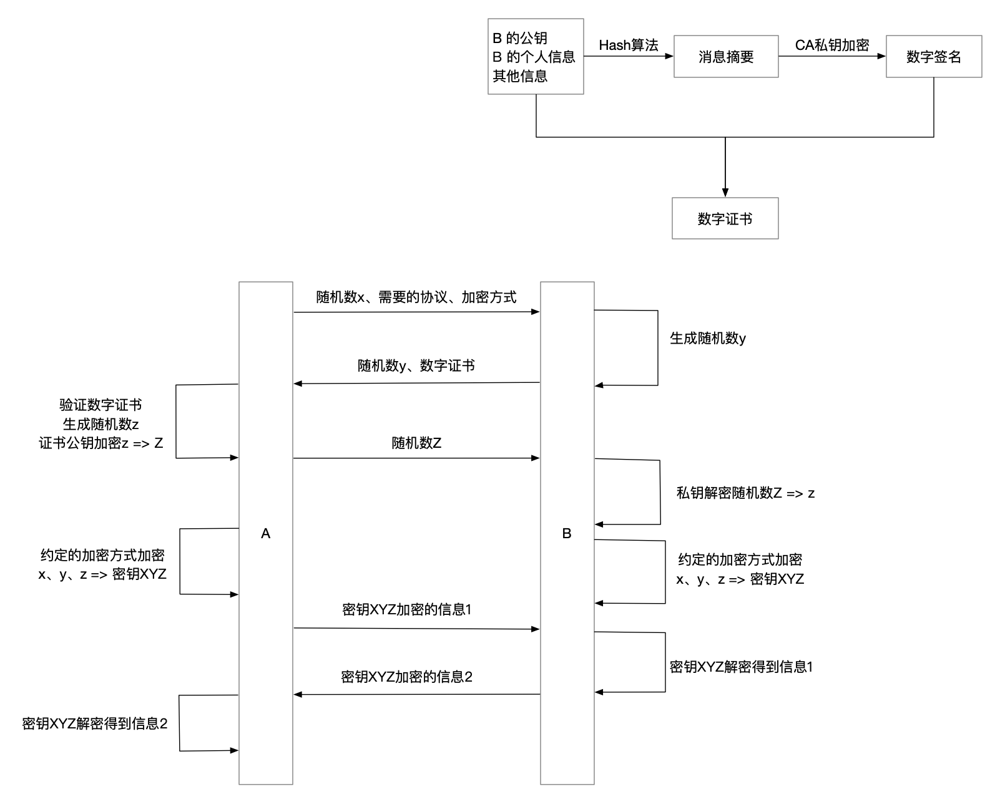

# HTTPS 究竟比 HTTP 多了什么

## HTTP 存在什么问题

- 可能被窃听：HTTP 本身不具有加密功能，报文直接使用明文方式传输
- 可能遭遇伪装：HTTP 通信时不验证通信方，可能服务端是伪装的，也可能客户端是伪装的
- 可能被篡改：HTTP 无法验证报文完整性，报文传输过程中，即使请求或者响应被篡改了，也无法得知，易受中间人攻击

## HTTPS 介绍

### HTTPS 是什么

HTTPS （全称：Hyper Text Transfer Protocol over SecureSocket Layer），是以安全为目标的 HTTP 通道，在HTTP的基础上通过传输加密和身份认证保证了传输过程的安全性。HTTPS 在 HTTP 的基础下加入 SSL/TSL 层，HTTPS 的安全基础是 SSL/TSL，因此加密的详细内容就需要 SSL/TSL。

### HTTPS 是怎么解决 HTTP 的问题的

通过 SSL/TSL 层进行传输加密和身份认证，建立一个安全的信息传输通道，来保证信息传输过程中不被窃听、伪装和篡改。

### SSL/TSL层是怎么保证信息传输通道安全的

在具体研究SSL/TSL层之前，我们先来自己看看怎么解决 HTTP 的问题。

#### 对称加密

首先，因为 HTTP 是明文传输，在整个传输过程中，传输内容都是直接可见的，要保证这一点的安全性，那么就需要一点，传输内容只能被通信双方看懂，其他人即使看到传输的内容，他也无法解读出真实内容，所以我们需要对内容进行加密。

A 和 B 都使用同样的一个加密规则来对内容进行加密，在接收到信息后，用这个加密规则解密出真实内容，这样的加密方式就是对称加密，即加解密的密钥相同。

> 过程：
>
> A 和 B 都知道纸条内的字母需要按照字母顺序移动3位进行解读
>
> A 要发送 secret message，按规则转为 pbzobq jbppxdb
>
> A => B: pbzobq jbppxdb
>
> C 截获到 pbzobq jbppxdb (这是啥？)
>
> B 接收到 pbzobq jbppxdb => secret message

如果说这个密钥是完全安全保密的，除了 A 和 B，没有其他人知道这个密钥，那么这样的加密方式就是安全的。但是，A 和 B 在之前没有接触过的情况下，要怎么确定下这个密钥？如果这个密钥也先通过 HTTP 进行传输，那么其他人就可以截获这个密钥，问题又回到了最初的状态。

#### 非对称加密

既然因为传输相同的加解密钥会被人截获，那么如果只由接收方 B 来解密，发送方 A 来加密，那么其他人由于没有这个解密密钥，就无法对内容进行解密了。就比如，A 先跟 B 发送一只鸽子跟 B 要个盒子，B 发送给 A 一只带了没有锁上盒子的鸽子，A 拿到盒子后，将纸条放入盒子并且上锁，送回给 B，B 收到盒子后用钥匙打开拿到纸条。

> 过程：
>
> A 给 B 飞了一只鸽子🐦
>
> B 给 A 飞了一只鸽子🐦，鸽子带着一个盒子，盒子上有锁🔒，但是锁没有锁上
>
> A 把纸条放到盒子中，把锁🔒锁上，用鸽子🐦飞给 B
>
> B 收到盒子，用钥匙🔑打开盒子，拿出纸条

C 因为没有钥匙，所以没法开锁拿到盒子内的纸条，所以纸条是安全的，这种方式就是非对称加密啊，盒子为公钥，钥匙为私钥。

#### 权威认证机构和证书

但是这里面有个问题，如果第二步中，这个鸽子带的盒子1被 C 换成盒子2，那么 A 拿到的盒子2并将纸条放到盒子2中，纸条也就被 C 拿到了，这时候 C 再将纸条放到盒子1 中，发回给 B，所以我们需要保证 A 能够知道这个盒子是可靠的，没有被替换过，这就需要一个权威的人 X 来给这个盒子打上特殊标记，不被信任的人是无法标记盒子的，这样 A 就能识别这个盒子了。X 就是一个权威认证机构。

> 过程：
> 
> A 给 B 飞了一只鸽子🐦
>
> B 给 A 飞了一只鸽子🐦，鸽子带着一个有标记的盒子，盒子上有锁🔒，但是锁没有锁上
>
> A 拿出标记识别指南，对比盒子的标记，发现是 B 的盒子，把纸条放到盒子中，把锁🔒锁上，用鸽子🐦飞给 B
>
> B 收到盒子，用钥匙🔑打开盒子，拿出纸条

#### 非对称加密 + 对称加密

现在 A 和 B 通过这种方式，就可以进行安全的通信了，但是每次传纸条都需要进行这些步骤是很累的，而且鸽子那么小，总是带着个沉重的盒子，会很累，飞的慢。所以回到前面对称加密方式那里，是不是我们只要保证对称加密的密钥不被 C 知道，那么通信就是安全的？所以我们通过上面非对称加密的方式来传输对称加密的密钥，确保这个密钥是安全的就好了，鸽子就不需要每次都带个沉重的盒子。

#### SSL/TSL的过程

## 总结

HTTP 存在被窃听、被伪装和被篡改的可能，HTTPS 通过增加 SSL/TSL 层进行传输加密和身份认证，确保通信通道的安全，使用非对称加密来加密对称加密使用的密钥，需要权威机构的认证来确保证书公钥的可靠性，以上就是 HTTPS 比 HTTP多出来的内容啦。